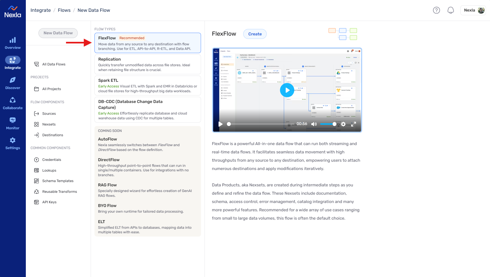

# Nexla Data Pipeline to Weaviate Vector Indexing Tutorial
## Introduction
---
Welcome to this step-by-step guide on integrating Nexla data pipelines with Weaviate vector indexing. In this tutorial, we'll walk you through the entire process of setting up a robust data pipeline tailored for vector indexing. Let’s dive in!

## Step-by-Step Guide
---
1. **Initiating a New Data Pipeline**: Within [Nexla's Platform](https://dataops.nexla.io/login) start by creating a new data flow. Navigate to `Integrate > New Data Flow` and follow the on-screen instructions as depicted below.

  
2. **Choosing Your Data Flow Type**: Various types of data flows are available, but for versatility, select `FlexFlow`. Click the `create` button to proceed.

  
3. **Setting Up a Data Source**: Explore a wide range of connectors sorted by industry on the sidebar. For this guide, we’ll use the FTP Connector. Feel free to choose one that aligns with your needs.

  
4. **Managing Credentials**: If you already have credentials for this connector, they will be displayed here. To add new credentials, click on `Add Credential` and securely enter your details. Our system ensures encrypted storage and role-based access control, keeping credentials safe yet accessible to authorized users only.

   
5. **Configuring the Source**: After authentication, you can configure the source and its settings to meet your specific data requirements.

  
6. **Automatic Data Structure Detection**: Nexla will auto-detect the structure of your incoming data, represented as a Nexset, which abstracts the data's logical structure based on initial samples. Click the highlighted symbol for an overview.

  
7. **Data Transformation (Optional)**: You may choose to refine the incoming data. Access the Transform page by clicking the selection icon on the Nexset. Use the tools provided to adjust your data as it flows in.

  
8. **Finalizing the Setup**: After customizing your data, hit `Save & Close`. A new Nexset will be created, capturing the transformed data, ready to be routed to your desired destination.

  
9. **Routing Data to Destination**: Click the `Send` icon to initiate data transfer. You’ll find this process familiar, as most of our connectors support both sourcing and destination functionalities.

  
10. **Integrating with Weaviate**: Locate the `Weaviate` connector under the `Databases` category and proceed to the next configuration step.

  
11. **Configuring Weaviate Credentials**: Similar to earlier, either select an existing Weaviate credential or create a new one, demonstrated below.

Key fields for Weaviate connection:
- **Credential Name**: Choose a name for easy future reference.
- **Credential Description**: Provide a brief description for team clarity.
- **Weaviate Instance URL**: The REST Endpoint of your Weaviate Cluster.
- **API Key Value**: Your Weaviate Cluster's API key.
- **API Version**: Select the desired API version for this connection.
- **LLM Provider API Key**: Optionally, include an API key from OpenAI, Cohere, or Hugging Face for processing text into vector embeddings.
  
12. **Configuring the Payload**: Here you will be able to see a preview of the Payload we are delivering to Weaviate, you can make a feel adjustments if needed. After everything is set up, just hit on `save`.

  
After you click on save, that’s it! You’ve successfully set up a complete data pipeline integrated with Weaviate vector indexing within Nexla. The data will now flow seamlessly, and you’ll soon see the vectors populating your Weaviate cluster. For more personalized guidance or a live demonstration, [schedule a demo here](https://nexla.com/demo/).
